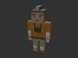
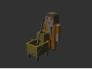
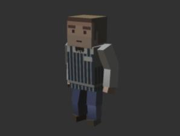
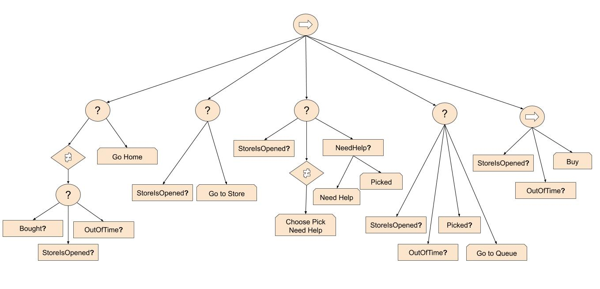
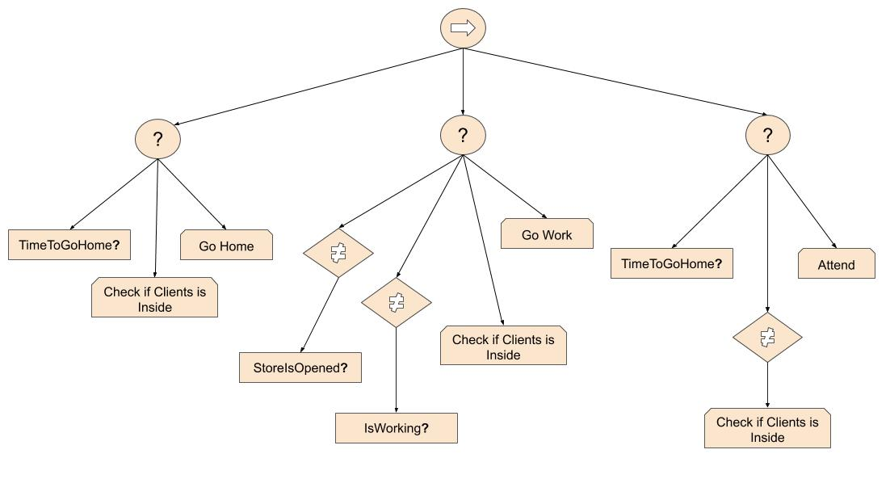
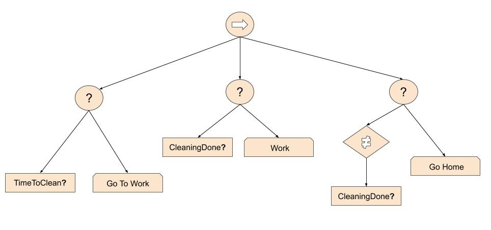
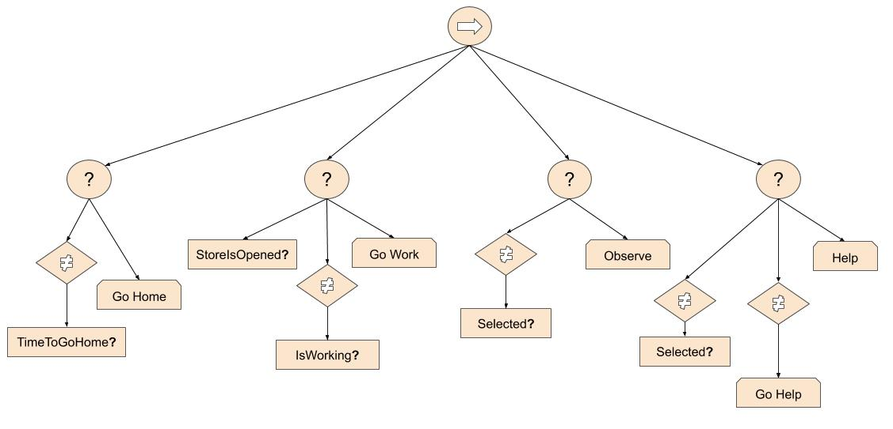

# Description

Grocery Store AI is an Artificial Intelligence based game made with Unity developed for a university project in CITM UPC (Terrasa, Spain) in our degree in Videogame Developement and Design.

It has 4 entities; cashier, client, cleaner and dependant that complete their function in a usual grocery store by our own programmed Steering Behaviours and with their own Behaviour Trees to move across, in and out of the store with its corresponding day/night cycle.

The objective of the game is to mantain the correct attendance and help towards the clients in order to keep the business running. The entities move by themselves but the player can choose some actions shown in the UI. The player will win after completing 3 days but will lose if before those 3 days he/she does not help 5 or more clients in need of it.

## Authors 

This game was created by two memebers:

* Gerard Gil: [https://github.com/Gerard346](https://github.com/Gerard346)

* Manav Lakhwani: [https://github.com/manavld](https://github.com/manavld)

# Screenshots

# Gameplay Video

[Link](url)

# How To Play

Download the .zip in the last release in [https://github.com/Gerard346/Project-AI/releases](https://github.com/Gerard346/Project-AI/releases) and open the file .exe to play the game.

## Controls

* WASD: Camera Movement
* R: Return camera to initial position

# Links

## Github Repository

[https://github.com/Gerard346/Project-AI](https://github.com/Gerard346/Project-AI)

## Link to the Wiki

You will find more information about the game and the Behaviour Trees in the wiki: [https://github.com/Gerard346/Project-AI/wiki](https://github.com/Gerard346/Project-AI/wiki)

# Entity Information

## Types Of Agents

### Cashier

Spawn, Paths to his cash and waits till his turn is finished. Then goes home around 10 o'clock at night.

### Client

Spawns when the shop is open, goes to inside the shop, picks an area to pick an object, then wait his turn in the queue to buy the thing he picked, when a spot is clear, he goes in and buys. He stays there a bit with the cashier, waiting his change. After he got the change, he goes home.

### Cleaner

At 12::00 at night he comes to clean the shop, after he cleaned all the shop he goes home.

### Dependent

Goes to the store when his shift starts, waits and observes clients if they need help, helps the clients when they do, goes home when shift ends.

## Behaviour Trees

* **Client**: The client will decide to go to the store if open, go to the object he need and pick it up or ask for help, when picked the client will go to the queue, buy his items, and go home when bought.

* **Cashier**: The cashier will go to work when the store is open, start working when its his turn, attend the clients when client is buying and go home when his turn ended.

* **Cleaner**: The cleaner will walk to work when its his turn to work, grab the mob and start working until his time is done, leaves the mob back and goes back home.

* **Dependent**: The dependent will go to work when his shift starts, will observe the clients in case they need help, when client is in need of help the dependent will go there and help the client and when his shift ends he will leave the shop and go home.

